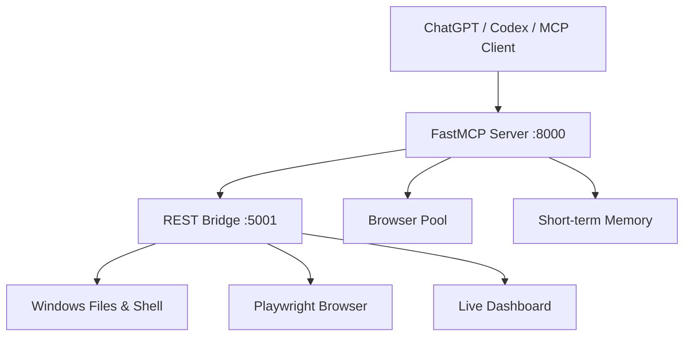

# EN MOSTAFA AI AGENT

> وكيل أتمتة محلي يربط ChatGPT وCodex وأي عميل MCP بنظام Windows، مع تشغيل أوامر النظام وإدارة الملفات والتحكم في المتصفح ولوحة متابعة مباشرة.

[](https://www.python.org/)
[](https://modelcontextprotocol.io/)
[](https://playwright.dev/python/)
[](#حالة-الإصدار)
[](LICENSE)

**[English documentation](README.md)**

## ما هو المشروع؟

EN MOSTAFA AI AGENT طبقة تنفيذ محلية تحول تعليمات نموذج الذكاء الاصطناعي إلى أدوات حقيقية على الجهاز. يتكون الإصدار من خادم MCP، وجسر REST محلي، ومحرك Playwright، وذاكرة قصيرة المدى، ولوحة مراقبة عربية تعرض حالة المتصفح واللقطات والأوامر.



## القدرات الرئيسية

- أدوات MCP لقراءة الملفات، استعراض المجلدات، البحث، إنشاء الملفات والمجلدات، وتنفيذ Shell.
- تحكم Playwright: فتح الصفحات، النقر، الكتابة، قراءة النصوص والخصائص، JavaScript، الانتظار، والتنقل.
- التقاط Screenshot عادية أو Base64، مع حفظها وإتاحتها للوحة المتابعة.
- تحليل DOM وUX أولي: العناوين، الصور، الروابط، `alt`، `viewport` ودرجة إرشادية.
- Browser Pool غير متزامن وإعادة محاولة تلقائية واتصالات HTTP Keep-Alive.
- ذاكرة قصيرة المدى مع TTL وسياق جلسة وسجل تفاعلات محدود.
- إدارة Jobs متزامنة Thread-safe ودعم pause/resume/cancel وأوامر عربية وإنجليزية.
- REST API ولوحة Dashboard عربية RTL وتحديثات Socket.IO.
- وحدات تجريبية للتخطيط والأهداف، التعلم من الأخطاء، تنفيذ المهام، قواعد ديناميكية، واكتشاف الاعتماديات.

راجع [قائمة القدرات التفصيلية](docs/CAPABILITIES.md) و[المعمارية](docs/ARCHITECTURE.md).

## التثبيت السريع على Windows

المتطلبات: Windows 10/11، Python 3.11، وGit.

```powershell
git clone https://github.com/EN-MOSTAFA-AIAGENT/en-mostafa-ai-agent.git
cd en-mostafa-ai-agent
py -3.11 -m venv .venv
.\.venv\Scripts\Activate.ps1
py -3.11 -m pip install --upgrade pip
py -3.11 -m pip install -r requirements.txt
py -3.11 -m playwright install chromium
Copy-Item .env.example .env
```

أو شغّل:

```powershell
powershell -ExecutionPolicy Bypass -File .\scripts\install_windows.ps1
```

## التشغيل

افتح نافذتي PowerShell داخل مجلد المشروع بعد تفعيل البيئة الافتراضية.

```powershell
# النافذة الأولى: REST + Dashboard
python .\src\server.py

# النافذة الثانية: MCP Server
python .\src\mcp_server.py
```

- Health: `http://127.0.0.1:5001/healthz`
- Dashboard: `http://127.0.0.1:5001/dashboard`
- MCP SSE: `http://127.0.0.1:8000/sse`

مثال إعداد عميل MCP يدعم SSE:

```json
{
  "mcpServers": {
    "en-mostafa-agent": {
      "url": "http://127.0.0.1:8000/sse"
    }
  }
}
```

## الأمان

الإصدار العام يبدأ بالقيم الآمنة التالية:

- `REST_HOST=127.0.0.1`
- `MCP_HOST=127.0.0.1`
- `READONLY_MODE=true`

لتفعيل أدوات الكتابة والتنفيذ محليًا، غيّر `READONLY_MODE=false` بعد مراجعة [سياسة الأمان](SECURITY.md). لا تعرض المنفذين 5001 أو 8000 للإنترنت مباشرة، ولا تستخدم Cloudflare Tunnel أو Port Forwarding من دون طبقة مصادقة وTLS وقواعد وصول.

## بنية المشروع

```text
src/                 النواة القابلة للتشغيل
experimental/        وحدات قيد الدمج وليست ضمن مسار التشغيل الافتراضي
docs/                المعمارية والقدرات ودليل التشغيل
scripts/             تثبيت وتشغيل Windows
tests/               اختبارات النواة المستقلة
.github/workflows/   فحص Python تلقائيًا
```

## حالة الإصدار

هذا **Public Preview**. النواة الأساسية قابلة للفحص والتشغيل، بينما الوحدات الموجودة في `experimental/` تحتاج دمج الاعتماديات الداخلية غير المرفقة واختبارات تكامل قبل اعتبارها Production-ready. انظر [خارطة الطريق](docs/ROADMAP.md).

## المساهمة

اقرأ [CONTRIBUTING.md](CONTRIBUTING.md). بلّغ عن الثغرات بصورة خاصة وفق [SECURITY.md](SECURITY.md)، ولا تنشر مفاتيح أو مسارات شخصية أو لقطات شاشة حساسة في Issues.

## المؤلف

**Mostafa Selim Farag** — Senior Web Application Developer
[devmostafa.com](https://www.devmostafa.com)

## الترخيص

حقوق النشر © 2026 مصطفى سليم فرج. المشروع متاح بموجب [Apache License 2.0](LICENSE)، مع معلومات النسب في [NOTICE](NOTICE).
