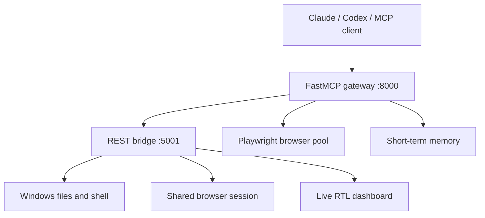

# EN MOSTAFA AI AGENT

> A Windows-first, Arabic-aware local agent runtime that connects MCP clients to browser automation, files, system tools, short-term memory, and a live operator dashboard.

[](https://www.python.org/)
[](https://modelcontextprotocol.io/)
[](https://playwright.dev/python/)
[](https://github.com/EN-MOSTAFA-AIAGENT/en-mostafa-ai-agent/actions/workflows/ci.yml)
[](LICENSE)
[](docs/DEVELOPMENT_STATUS.md)

**[الوثائق العربية](README.ar.md)**

## Why this project exists

Most desktop agent projects assume a Unix environment, English-only commands, or a hosted execution backend. EN MOSTAFA AI AGENT explores a different path: a transparent local runtime for Windows developers and operators, with Arabic and English commands, explicit safe and power tool planes, observable browser sessions, and provider-neutral MCP connectivity.

The project is designed for people who need an AI assistant to do verifiable work on a real machine—not only generate instructions—while keeping the operator in control of the execution boundary.

## What it provides

- A FastMCP gateway for Claude-compatible and other MCP clients.
- A local Flask REST bridge for filesystem and system operations.
- Playwright browser automation: navigation, extraction, interaction, screenshots, rendering, and lightweight UX analysis.
- An Arabic RTL dashboard with live status, logs, screenshots, and commands.
- Short-term TTL memory and bounded interaction history.
- Thread-safe jobs with pause, resume, cancel, and waiting-for-user states.
- Arabic and English natural-language commands for common browser actions.
- Windows-first setup scripts pinned to Python 3.14.
- Safe public defaults: loopback binding and read-only mode.



## Quick start on Windows

Requirements: Windows 10/11, Python 3.14, and Git.

```powershell
git clone https://github.com/EN-MOSTAFA-AIAGENT/en-mostafa-ai-agent.git
cd en-mostafa-ai-agent
py -3.14 -m venv .venv
.\.venv\Scripts\Activate.ps1
py -3.14 -m pip install --upgrade pip
py -3.14 -m pip install -r requirements.txt
py -3.14 -m playwright install chromium
```

Start the REST bridge and MCP gateway in separate terminals:

```powershell
.\scripts\run_rest.ps1
.\scripts\run_mcp.ps1
```

Then open:

- Health check: `http://127.0.0.1:5001/healthz`
- Operator dashboard: `http://127.0.0.1:5001/dashboard`
- MCP SSE endpoint: `http://127.0.0.1:8000/sse`

Example MCP client configuration:

```json
{
  "mcpServers": {
    "en-mostafa-agent": {
      "url": "http://127.0.0.1:8000/sse"
    }
  }
}
```

See the full [Windows installation guide](docs/INSTALLATION.md) and [capability reference](docs/CAPABILITIES.md).

## Safety model

This release starts with:

```dotenv
REST_HOST=127.0.0.1
MCP_HOST=127.0.0.1
READONLY_MODE=true
```

Power tools can modify files and execute shell commands with the permissions of the running user. Do not expose ports 5001 or 8000 directly to a LAN or the internet. Read [SECURITY.md](SECURITY.md) before enabling write or execution capabilities.

## Real-world validation

The runtime grew from practical automation work rather than a synthetic agent demo. Maintainer-run field tests have included:

- Website inspection on `askmbt.com`: DOM extraction, full-page capture, an accessibility-oriented UX check, and a generated local report.
- WordPress operations in a live site workflow, combining browser inspection with safe local execution.
- Windows maintenance workflows on a Dell Latitude system: dependency checks, update orchestration, driver verification, and restore-point-aware execution.

These are maintainer-reported validations, not ecosystem adoption metrics. Reproducible scenarios and current limitations are documented in [Project impact](docs/PROJECT_IMPACT.md) and [Development status](docs/DEVELOPMENT_STATUS.md).

## Repository map

```text
src/                 Runnable MCP, REST, browser, memory and job core
experimental/        Supplied research modules awaiting missing internal adapters
wordpress-plugin/    Existing WordPress REST, heartbeat and self-healing adapter
chrome-extension/    Existing browser bridge and contextual automation extension
templates/           Existing operator dashboard templates
root Python modules  Established 2.x runtime and integration modules
docs/                Architecture, capabilities, impact, security and roadmap
scripts/             Windows setup and launch commands
tests/               Independent core and service smoke tests
.github/              CI and community contribution templates
```

## Maturity and scope

This is a **public preview**, not a production security boundary. The runnable core is included and tested. The planning, strategy, self-monitoring, and autonomous-loop research modules are clearly isolated under `experimental/` because several internal adapters were not present in the supplied public snapshot. No adoption, contributor, download, or dependency numbers are claimed.

Read [Development status](docs/DEVELOPMENT_STATUS.md), [Architecture](docs/ARCHITECTURE.md), and the [Roadmap](docs/ROADMAP.md).

## Contributing

External contributors are welcome. Start with [CONTRIBUTING.md](CONTRIBUTING.md), open a focused issue, and review the privilege implications of any filesystem, shell, dependency-installation, or browser change. Security issues should be reported privately according to [SECURITY.md](SECURITY.md).

## Maintainer

**Mostafa Selim Farag** — Senior Web Application Developer
[devmostafa.com](https://www.devmostafa.com)

## License

Copyright 2026 Mostafa Selim Farag. Licensed under the [Apache License 2.0](LICENSE). See [NOTICE](NOTICE) for attribution information.
